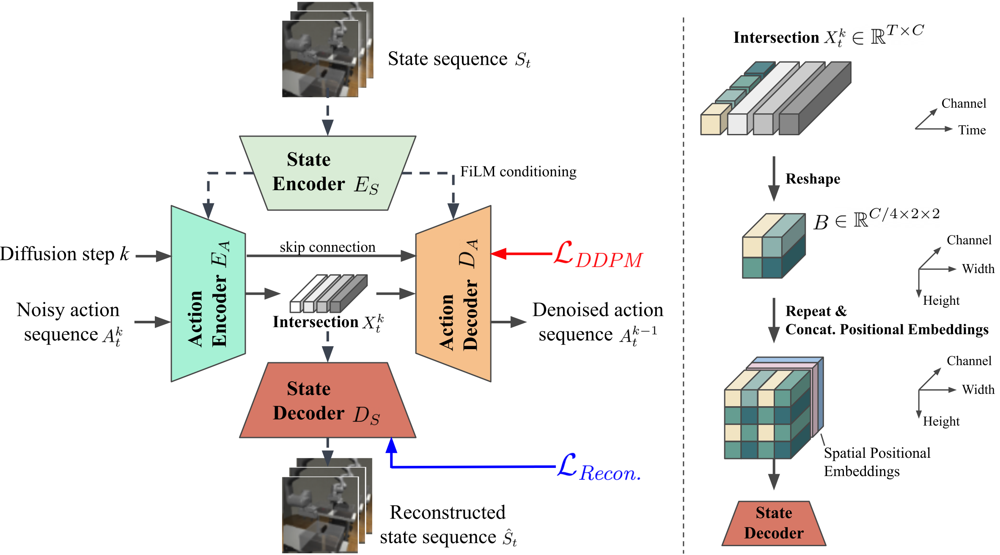

# Crossway Diffusion

This is the official implementation of the paper [Crossway Policy: Improving Diffusion-based Visuomotor Policy via Self-supervised Learning](https://arxiv.org/abs/2307.01849). 

The code is modified from [Diffusion Policy](https://github.com/real-stanford/diffusion_policy).

## Demo Video
Click the GIF below to check the [full video](https://youtu.be/9deKHueZBuk)!

## Our Method

We propose *Crossway Diffusion*, a simple yet effective method to enhance diffusion-based visuomotor policy learning via a carefully designed state decoder and a self-supervised learning (SSL) objective.

Our major contribution is included in:
1. [diffusion_policy/workspace/train_crossway_diffusion_unet_hybrid_workspace.py](diffusion_policy/workspace/train_crossway_diffusion_unet_hybrid_workspace.py) (newly added)
2. [diffusion_policy/policy/crossway_diffusion_unet_hybrid_image_policy.py](diffusion_policy/policy/crossway_diffusion_unet_hybrid_image_policy.py) (newly added)
3. [diffusion_policy/model/diffusion/conv2d_components.py](diffusion_policy/model/diffusion/conv2d_components.py) (newly added)
4. [diffusion_policy/model/diffusion/conditional_unet1d.py](diffusion_policy/model/diffusion/conditional_unet1d.py) (modified)

## Installation
We use the same environment as the Diffusion Policy. Please refer to [this instruction](https://github.com/real-stanford/diffusion_policy/blob/main/README.md) for a detailed installation guide.

After installation, we recommend replacing the original `robomimic/envs/env_robosuite.py` in `robomimic` with [the version we provided in this repo](patch/env_robosuite.py)  for better control of the image rendering device.

## Download Training Data
Please follow the guide at [this link](https://github.com/columbia-ai-robotics/diffusion_policy/blob/main/README.md) to download the simulated datasets.

Our real-world datasets follow the same structure as [robomimic](https://robomimic.github.io/docs/datasets/overview.html). 
Please check [dataset_readme.md](dataset_readme.md) for training on this dataset and your own datasets.
They are available at this [Google Drive Link](https://drive.google.com/drive/folders/1VWzLZ38fuOVJpbp3gnQSb0ucAEl7ALt1?usp=sharing).

## Start Training
To train the model on simulated datasets with a specific random seed:

`EGL_DEVICE_ID=0 python train.py --config-dir=config/${task}/ --config-name=type[a-c].yaml training.seed=4[2-4]`

where `${EGL_DEVICE_ID}` defines which GPU is used for rendering simulators, `${task}` can be `can_ph`, `can_mh`, `lift_ph`, `lift_mh`, `square_ph`, `square_mh`, `transport_ph`, `transport_mh`, `tool_hang_ph` and `pusht`.

The result will be stored at `outputs/` and `wandb/`. In our experiments, we use 42, 43 and 44 as the random seeds.

## Evaluation
Similarly, you can launch the evaluation code:
`EGL_DEVICE_ID=0 python eval.py --checkpoint <path to checkpoint>.ckpt --output_dir <path for output> --device cuda:0`
The code will evaluate for 50 episodes by default and you will find the evaluation results at `<path for output>/eval_log.json`. 

## Pretrained Models
Our pretrained models (for 500 epochs) are available at `https://vision.cs.stonybrook.edu/~mryoo/crossway/ckpts/crossway_diffusion-<task>-s<seed>.ckpt` as well as the SHA1 checksums at  `https://vision.cs.stonybrook.edu/~mryoo/crossway/ckpts/crossway_diffusion-<task>-s<seed>.ckpt.sha1`.

The evaluation results are available at  `https://vision.cs.stonybrook.edu/~mryoo/crossway/ckpts/crossway_diffusion-<task>-s<seed>.ckpt.json`. 

Please replace `<task>` with a specific task name and replace `<seed>` with 42, 43, or 44 to get a valid link.

For example, the pretrained model for task Push-T trained on seed 42 is at the link below:
`https://vision.cs.stonybrook.edu/~mryoo/crossway/ckpts/crossway_diffusion-pusht-s42.ckpt`

## License
This repository is released under the MIT license. See [LICENSE](LICENSE) for additional details.
